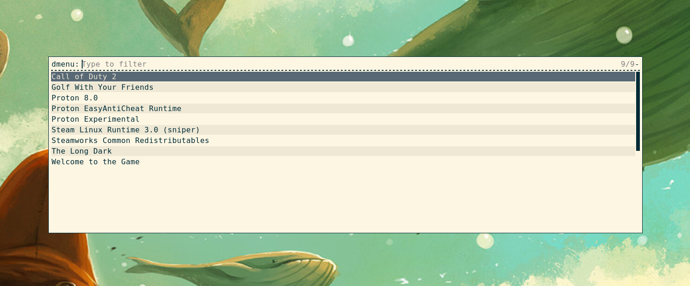

# rsteam
Simple script for launching steam games with Rofi

## Usage
The only special dependancy that rsteam uses is rofi and requires no configuration. rsteam quickly reads the manifest for each installed steam game for the information that it needs on startup. All rsteam needs is to be put on the system's PATH and ran. 

